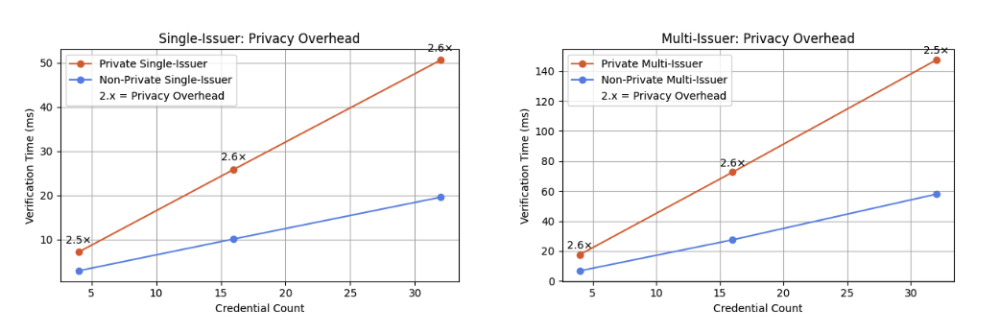
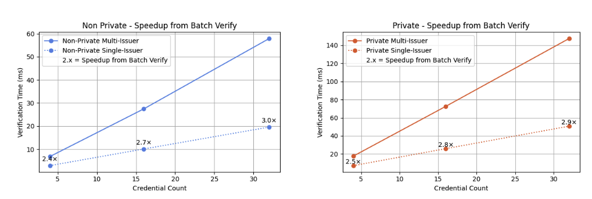
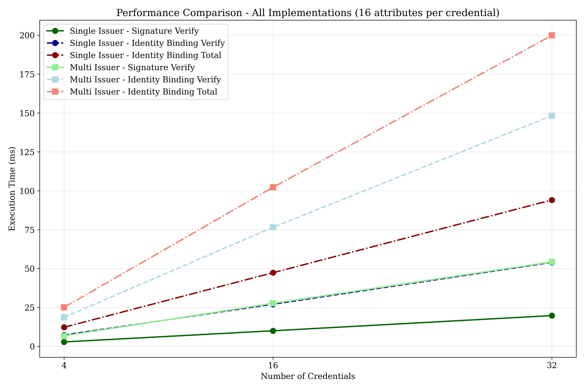

# MIMC-ABC: Multi-Issuer Multi-Credential Anonymous Credential System

## Overview

In a world where we are all using digital credential wallets and want to verify multiple credentials together, for example, a KYC scenario. I proposed `identity binding` in my paper (to be uploaded somewhere) as a security property and instantiated it with sigma protocols proving equality of an identifier within credentials.

Much of the existing literature shows benchmarks for anonymous credential systems like Idemix to be at 110ms, 220ms, 450ms for 1,2,3 credentials [1] or Microsoft’s U-Prove to be (180ms,460ms,600ms) for 1,2,3 credentials verified together[1]. That's not efficient enough!

So this project confirms that it is actually efficient enought to be used and adding privacy costs 2.6x non-private scheme does (using PS based signatures and zero knowledge proofs.).

I use a PS Signature [2] based off the construction in the UTT paper[3] and discuss this in [my Thesis](https://github.com/sampolgar/mphil)

[1] Evaluation of Privacy-ABC Technologies - a Study on the Computational Efficieny https://link.springer.com/chapter/10.1007/978-3-319-41354-9_5
[2] Short Randomizable Signature - David Pointcheval, Olivier Sanders: https://link.springer.com/chapter/10.1007/978-3-319-29485-8_7
[3] UTT: Decentralized Ecash with Accountable Privacy - Alin Tomescu, Adithya Bhat, Benny Applebaum, Ittai Abraham, Guy Gueta, Benny Pinkas, and Avishay Yanai https://eprint.iacr.org/2022/452

## Benchmarks

There are 4 benchmark scenarios:
Non-Private means we verify a signature with the message in plain-sight, no using zero knowledge proof verification.
Non-Batch means we verify each signature individually, we don't use Signature Batch verification (this comes from the PS based signature, if signatures are signed with the same key they can be aggregated before verification saving cost). Multi-issuer means we verify each individually because batch is not possible.

## Results

### Privacy Overhead

These graphs show the cost of privacy for single-issuer (left) and multi-issuer(right) credential use with multiple credentials. The graph shows a 2.6x increase in Show+Verify time for private multi-credential use. The left graph shows single-issuer multi-credential verification (with batch verification). The right graph shows multi-issuer multi-credential verification (no batch verification). Both graphs use a credential with 16 attributes displaying Show+Verify time


### Batch Verify Speedup

These graphs show the benefit of single-issuer signature aggregation, but also show that multi-issuer credential verification adds small 2.4x-3x overhead and therefore does not impact the Show+Verify significantly


## Installation

```sh
# Clone the repository
git clone https://github.com/sampolgar/mimc_abc.git
cd mimc_abc

# Bench
cargo bench
```

## Project Structure

- [`src`](src) - Core library implementation
  - [`credential.rs`](src/credential.rs) - Base credential functionality
  - [`multi_issuer.rs`](src/multi_issuer.rs) - Multi-issuer implementation
  - [`identity_binding.rs`](src/identity_binding.rs) - Identity binding mechanisms
  - [`proof.rs`](src/proof.rs) - Zero-knowledge proof implementations
- [`benches`](benches) - Performance benchmarking suite
  - [`credential_scenarios.rs`](benches/credential_scenarios.rs) - Benchmark scenarios

## How to Run Benchmarks

The project includes a comprehensive benchmarking suite to evaluate the performance of different verification methods. Follow these steps to run the benchmarks:

1. **Install Rust**: Ensure you have Rust installed. You can install it from [rustup.rs](https://rustup.rs/).

2. **Clone the Repository**:

   ```sh
   git clone https://github.com/sampolgar/mimc_abc.git
   cd mimc_abc
   ```

3. **Run Benchmarks**:

   ```sh
   cargo bench
   ```

   This will run the benchmarks defined in credential_scenarios.rs, including:

   - Non-private, non-batch verification
   - Non-private batch verification
   - Multi-credential batch verification
   - Multi-issuer identity binding verification

4. **Analyze Results**: The benchmark results will be displayed in the terminal, showing the performance of each verification method under different configurations (e.g., varying numbers of credentials and attributes).

   For detailed analysis, check the [`benches_analysis`](benches_analysis) directory, which contains Python scripts for data extraction and visualization.

I show execution times for verifying multiple credentials together with identity binding. The worst case scenario for 32 credentials from different issuers is 200ms which is very fast!


## Technical Background

MIMC-ABC employs position-binding commitments and zero-knowledge proofs to cryptographically bind credentials from distinct issuers to a single, private identifier. Our security model formalizes the identity binding property, ensuring anonymity and unforgeability even against colluding adversaries.

Performance evaluations show that privacy-preserving multi-issuer verification, though approximately 3× slower than non-private baselines (e.g., 18.67ms vs. 6.77ms for 4 credentials), remains efficient for practical use.

## Citation

If you use MIMC-ABC in your research, please cite it as:

```
@software{mimc_abc,
  author = {Polgar, Sam},
  title = {MIMC-ABC: Multi-Issuer Multi-Credential Anonymous Credential System},
  url = {https://github.com/sampolgar/mimc_abc},
  year = {2025}
}
```

Originally from my project `https://github.com/sampolgar/anonymous-credentials/tree/main/mimc_abc`

## Contributing

Contributions are welcome! Please feel free to submit a Pull Request.

## License

This project is licensed under the terms of the MIT License.
